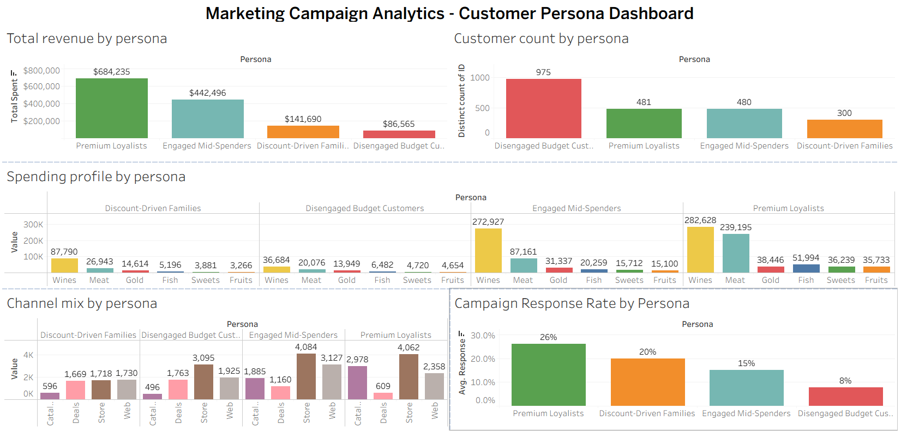
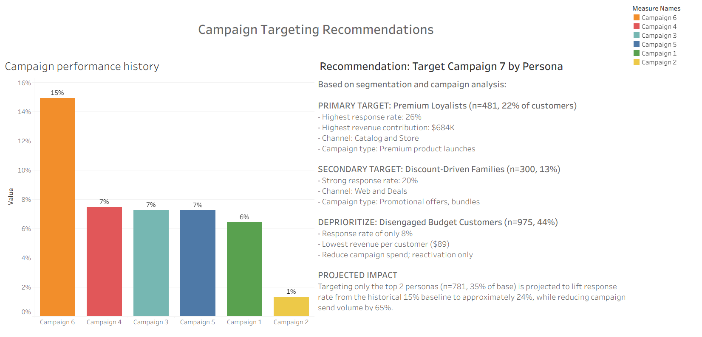

# Marketing Campaign Analytics: Customer Segmentation & Targeting Strategy

> **End-to-end customer analytics project** identifying high-value customer personas and recommending a targeted campaign strategy projected to lift response rate from 15% → 24% while reducing campaign volume by 65%.

---

## 📌 Business Problem

A retailer ran 6 marketing campaigns over 2 years with declining response rates. Campaign performance ranged from 1% (Campaign 2) to 15% (Campaign 6) without a clear understanding of *why* some campaigns succeeded. The marketing team needed:

1. A data-driven understanding of who their customers actually are
2. Identification of the highest-value customer segments
3. A targeted strategy for the next campaign, not another mass-send

This project analyzes 2,240 customer records spanning demographics, spending across 6 product categories, and campaign response history to build a customer segmentation framework and produce concrete targeting recommendations.

---

## 🎯 Key Findings

### 1. Revenue concentration follows the 80/20 rule
**22% of customers (Premium Loyalists) drive nearly 50% of all revenue.** Meanwhile, the largest customer group (44% of the base) contributes only 6% of revenue.

| Persona | % of Customers | % of Revenue |
|---|---|---|
| Premium Loyalists | 22% | **49%** |
| Engaged Mid-Spenders | 22% | 32% |
| Discount-Driven Families | 13% | 10% |
| Disengaged Budget Customers | 44% | 6% |

### 2. Past campaign engagement is the strongest predictor of future response
Customers who responded to Campaign 6 had accepted **11x more prior campaigns** than non-responders. Past behavior outperforms demographics as a targeting signal.

### 3. Catalog is the high-value channel
Premium Loyalists made **6.2 catalog purchases** on average vs. 0.5 for Disengaged customers. Catalog usage is the cleanest behavioral signal of premium customer value.

### 4. Family status matters more than age
Big spenders are 5x less likely to have children at home than low spenders, while age is essentially identical between groups (45.5 vs 46.4). **Household composition outperforms age as a segmentation variable.**

---

## 💡 Targeting Recommendation

Targeting only the top 2 personas (35% of customer base) is projected to lift response rate from the historical 15% baseline to approximately 24%, while reducing campaign send volume by 65%.

| Action | Persona | Reason |
|---|---|---|
| 🥇 Primary target | Premium Loyalists | 26% response rate, $684K revenue, catalog channel |
| 🥈 Secondary target | Discount-Driven Families | 20% response rate, deal-responsive, web/email channel |
| ⚠️ Different strategy | Engaged Mid-Spenders | High spend but low campaign response, use in-store promo |
| ❌ Deprioritize | Disengaged Budget Customers | 8% response, lowest revenue per customer, marketing spend wasted |

---

## 🛠 Methodology

The project was built across 3 sequential Jupyter notebooks plus a Tableau dashboard:

### Notebook 1: Data Exploration & Cleaning
- Loaded 2,240 customer records from a tab-separated CSV
- Investigated 24 missing income values; confirmed Missing Completely At Random across age, education, and spending
- **Group-based imputation:** filled missing income with the median income of customers sharing the same education level (rather than overall median)
- Detected and removed 4 outliers (3 customers with implausible birth years 1893–1900, 1 customer with $666,666 income against $62 in spending)
- Engineered 7 derived features: Age, Total_Spent, Total_Purchases, Children, Has_Children, Customer_Tenure_Days, Total_Campaigns_Accepted

### Notebook 2: Business Analysis with SQL
Used SQLite as an in-memory database to run analytical SQL queries answering 5 core questions:
1. **Big-spender profiling** using `NTILE(10)` percentile windows
2. **Family vs. childless spending** by category (share-of-wallet analysis)
3. **Channel performance** with `UNION ALL` queries across 4 channels
4. **Campaign performance** comparison + responder profiling
5. **Education-level spending** to test if education predicts product preference

### Notebook 3: Customer Segmentation (K-Means Clustering)
- Selected 15 features: 4 demographic, 6 spending, 5 channel
- **StandardScaler** normalization to ensure equal feature weight
- **Elbow Method** evaluation across K=2 to K=10; chose K=4 for actionability
- Profiled clusters across 16 dimensions and assigned descriptive persona names
- Exported labeled dataset for dashboard consumption

### Tableau Dashboard
Built a 2-tab interactive dashboard:
- **Tab 1: Executive Summary** Revenue/customer count by persona, spending profiles, channel mix, campaign response rates
- **Tab 2: Targeting Recommendations** Campaign performance history with persona-level targeting strategy

---

## 🔧 Tools & Techniques

**Languages & libraries:** Python (pandas, NumPy, scikit-learn, matplotlib, seaborn), SQL (SQLite)
**Visualization:** Tableau Public
**Techniques:** group-based imputation, outlier detection, feature engineering, K-Means clustering, percentile windowing, share-of-wallet analysis, persona development

---

## 📂 Repository Structure

  marketing-analytics-project/
    ├── README.md
    ├── data/
    │   ├── marketing_campaign.csv             (raw)
    │   ├── marketing_campaign_clean.csv       (after cleaning)
    │   └── marketing_campaign_labeled.csv     (with cluster labels)
    ├── notebooks/
    │   ├── 01_data_exploration.ipynb
    │   ├── 02_business_analysis.ipynb
    │   └── 03_customer_segmentation.ipynb
    ├── dashboard/
    │   └── Marketing_dashboard.twbx
    └── images/
        ├── dashboard_tab1.png
        └── dashboard_tab2.png

---

## 📊 Data Source

Customer Personality Analysis dataset, sourced from Kaggle (uploaded by Akash Patel): [https://www.kaggle.com/datasets/imakash3011/customer-personality-analysis]. 2,240 customer records spanning July 2012 - June 2014.

---

## 🚀 How to Reproduce

1. Clone the repository
2. Install dependencies: `pip install pandas numpy scikit-learn matplotlib seaborn`
3. Run notebooks in order: `01_data_exploration.ipynb` → `02_business_analysis.ipynb` → `03_customer_segmentation.ipynb`
4. Open `dashboard/Marketing_dashboard.twbx` in Tableau Public to view the dashboard

---

*Project completed [March 2026]. Author: [Rameen Shakeel].*
